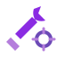
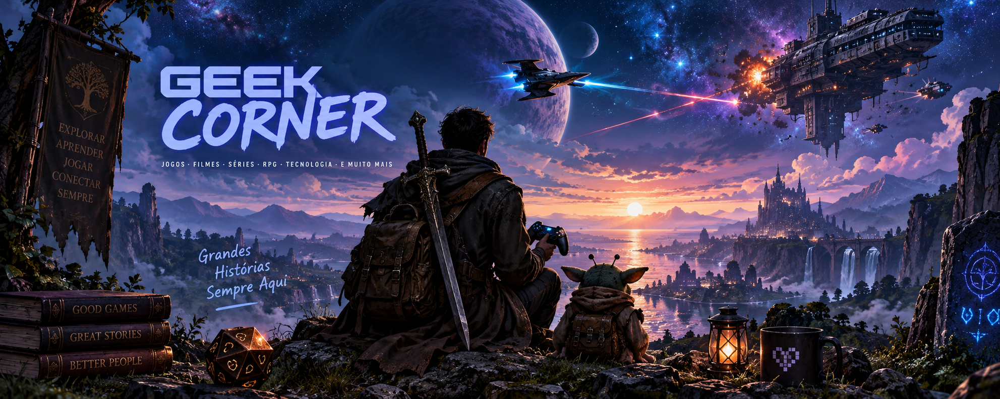

# João Henrique Gusmão Esteves

### Technology Project Manager | PMO | Digital Transformation

Gerente de Projetos de Tecnologia com foco em **governança, transformação de processos e entrega de soluções corporativas**.

Background técnico em sistemas e desenvolvimento aplicado hoje à conexão entre **estratégia, negócio, pessoas e tecnologia**.

 

---

  
  &nbsp;&nbsp;
  <strong>ATUAÇÃO PROFISSIONAL</strong>
  &nbsp;&nbsp;
  

 

| Gestão & Governança | Entrega & Transformação |
| --- | --- |
| **Project Management** — planejamento, execução, controle e encerramento | **Agile & Hybrid Delivery** — Scrum, Kanban e modelos híbridos |
| **PMO & Governança** — indicadores, riscos, decisões e rastreabilidade | **Process Automation** — workflows, digitalização e melhoria de processos |
| **Stakeholder Management** — alinhamento entre negócio e tecnologia | **Enterprise Systems** — ERP, ITSM, integrações e dados |

  
  
  
  

---

  
  &nbsp;&nbsp;
  <strong>PROJECT MANAGEMENT PORTFOLIO</strong>
  &nbsp;&nbsp;
  

 

<strong>Cases profissionais reconstruídos para demonstrar contexto, abordagem de gestão, decisões, artefatos e resultados — sem exposição de informações corporativas sensíveis.</strong>

<table align="center" width="100%">
  <tr>
    <th align="left" width="25%">ÁREA / PROJETO</th>
    <th align="left" width="35%">DESCRIÇÃO</th>
    <th align="center" width="25%">TECNOLOGIAS / CONTEXTO</th>
    <th align="center" width="15%">ACESSO</th>
  </tr>
  <tr>
    <td valign="top"><strong>PROCESS AUTOMATION</strong> Automação de processos  <a href="https://github.com/Joao-H-Esteves/case-automacao-gestao-documentos-fiscais"><strong>Case 01 — Automação da Gestão de Documentos Fiscais</strong></a></td>
    <td valign="top">Implantação de solução corporativa para automação, governança e centralização de documentos fiscais, com expansão de escopo, replanejamento, treinamento, Go-Live e transição para operação.</td>
    <td valign="middle" align="center">   </td>
    <td valign="middle" align="center">  </td>
  </tr>
  <tr>
    <td valign="top"><strong>ENTERPRISE SYSTEMS</strong> ERP &amp; soluções corporativas  <a href="https://github.com/Joao-H-Esteves/case-migracao-folha-pessoas-plus"><strong>Case 02 — Migração da Folha de Pagamento para Sankhya Pessoas+</strong></a></td>
    <td valign="top">Migração da folha de pagamento do ambiente legado MGE para o Sankhya Pessoas+, com capacitação de Key Users, homologação, eSocial, Benefícios, Go-Live, operação assistida e handover para sustentação.</td>
    <td valign="middle" align="center">   </td>
    <td valign="middle" align="center">  </td>
  </tr>
  <tr>
    <td valign="top"><strong>ITSM &amp; SERVICES</strong> Gestão de serviços  <a href="https://github.com/Joao-H-Esteves/case-transformacao-plataforma-itsm"><strong>Case 03 — Transformação de uma Plataforma de Gestão de Serviços de TI</strong></a></td>
    <td valign="top">Consolidação de ITSMs herdados após aquisições, integrando plataformas, processos e legados distintos com governança, CMDB, migração e evolução contínua por releases e sprints.</td>
    <td valign="middle" align="center">   </td>
    <td valign="middle" align="center">  </td>
  </tr>
  <tr>
    <td valign="top"><strong>DIGITAL TRANSFORMATION</strong> Integrações &amp; evolução tecnológica</td>
    <td valign="top">Integrações, automações e iniciativas de transformação de processos e tecnologia orientadas a eficiência e evolução operacional.</td>
    <td valign="middle" align="center">  </td>
    <td valign="middle" align="center">  </td>
  </tr>
  <tr>
    <td valign="top"><strong>AGILE DELIVERY</strong> Azure DevOps &amp; execução</td>
    <td valign="top">Organização da execução, rastreabilidade e gestão visual do trabalho em contextos ágeis e híbridos.</td>
    <td valign="middle" align="center">  </td>
    <td valign="middle" align="center">  </td>
  </tr>
  <tr>
    <td valign="top"><strong>PMO &amp; GOVERNANCE</strong> Controles &amp; governança</td>
    <td valign="top">Governança de projetos, indicadores, riscos, decisões, padronização e visibilidade executiva do portfólio.</td>
    <td valign="middle" align="center">  </td>
    <td valign="middle" align="center">  </td>
  </tr>
</table>

Os cases estão organizados por área de atuação e novos projetos serão adicionados progressivamente conforme forem reconstruídos e documentados para o portfólio.

> **Confidentiality by design:** os cases deste portfólio utilizam anonimização, generalização e/ou dados sintéticos. Documentos corporativos originais, dados pessoais, informações financeiras, credenciais e arquitetura sensível não são reproduzidos.

---

 &nbsp;&nbsp; <strong>COMO ESTRUTURO PROJETOS</strong> &nbsp;&nbsp; 

 

<strong>INICIAÇÃO</strong> &nbsp;→&nbsp; <strong>PLANEJAMENTO</strong> &nbsp;→&nbsp; <strong>EXECUÇÃO</strong> &nbsp;→&nbsp; <strong>MONITORAMENTO & CONTROLE</strong> &nbsp;→&nbsp; <strong>ENCERRAMENTO</strong>

Preditivo &nbsp;•&nbsp; Ágil &nbsp;•&nbsp; Híbrido

---

 &nbsp;&nbsp; <strong>FERRAMENTAS, MÉTODOS & DISCIPLINAS</strong> &nbsp;&nbsp; 

 

  
  
  
  
  
  
  
  
  

---

 &nbsp;&nbsp; <strong>TECHNICAL ROOTS</strong> &nbsp;&nbsp; 

 

Minha trajetória começou mais próxima do código: programação, bancos de dados, desenvolvimento web e infraestrutura.

<strong>Hoje essa base técnica é um diferencial na gestão de projetos de tecnologia.</strong>

Os repositórios antigos permanecem disponíveis como registro dessa evolução profissional.

---

  
  &nbsp;&nbsp;
  <strong>GEEK CORNER</strong>
  &nbsp;&nbsp;
  

 

<strong>Tecnologia é o que eu faço. Ser geek é parte de quem eu sou.</strong>

Entre projetos, código, ficção científica, games e universos improváveis, sigo acreditando que as melhores soluções começam com curiosidade.

 

  

---

  <strong>CONTATO & FORMAÇÃO</strong>
    
  
  
  

 

<strong>Projetos conectam estratégia, pessoas, processos e tecnologia.</strong>
